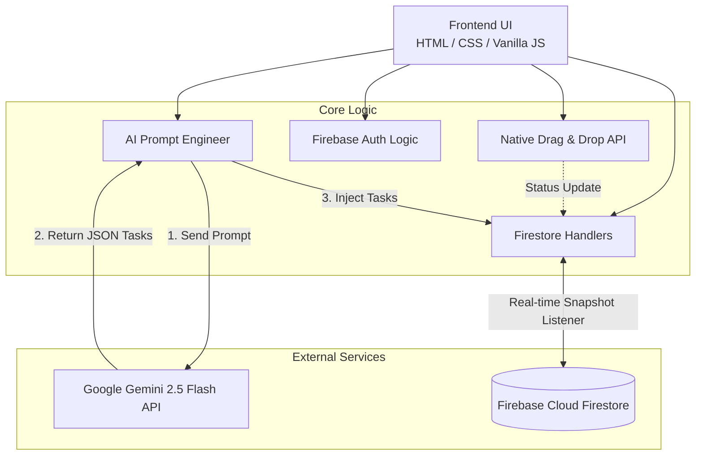

# ✨ กระดานคัมบังอัจฉริยะ (AI-Powered Kanban Board)

<div align="center">
<i>👉 <a href="README.md">🇬🇧 Read in English</a></i><br><br>

[](https://github.com/romeototo/ai-kanban-board/releases)
[](https://github.com/romeototo/ai-kanban-board/actions)
[](https://romeototo.github.io/ai-kanban-board/)
[](https://developer.mozilla.org/en-US/docs/Web/JavaScript)
[](https://firebase.google.com/)
[](https://ai.google.dev/)
[](LICENSE)

<br>

ระบบ **Real-time Kanban Board** ระดับพรีเมียมที่มาพร้อมฟังก์ชัน Drag & Drop แท้ๆ, ดีไซน์สไตล์ Glassmorphism และการรวมระบบ AI สำหรับการสร้างงานอัตโนมัติ สร้างขึ้นเพื่อแสดงทักษะการวิศวกรรมเว็บสมัยใหม่โดยไม่พึ่งพา Framework หนักๆ

---

## Project Snapshot

| รายการ | รายละเอียด |
| ------ | ----------- |
| **บทบาท** | AI-assisted planning board สำหรับแปลงงานกว้าง ๆ ให้เป็น task ย่อย |
| **Live demo** | [romeototo.github.io/ai-kanban-board](https://romeototo.github.io/ai-kanban-board/) |
| **Stack** | HTML, CSS, Vanilla JavaScript, Firebase, Gemini API |
| **Impact** | AI task breakdown, Firebase sync, drag-and-drop planning, analytics feedback |
| **สถานะ** | Active productivity tool |
| **Portfolio case study** | [AI-Powered Kanban Board](https://romeototo.github.io/portfolio-website/case-studies/ai-kanban-board/) |

---

## 🚀 ฟีเจอร์หลัก

- **🪄 AI Task Decomposition:** เพียงใส่แนวคิดโปรเจกต์กว้างๆ ระบบจะใช้ **Google Gemini 2.5 Flash** เพื่อย่อยงานเหล่านั้นออกมาเป็น Task ย่อยๆ ที่ทำได้จริงทันที
- **🤖 AI Agile Coach:** คลิกปุ่ม "Analytics" เพื่อให้ AI ตรวจสอบกระดานงานทั้งหมดและให้คำแนะนำเกี่ยวกับการกระจายภาระงานของคุณ
- **🔒 Private Authenticated Boards:** รองรับ **Firebase Authentication (Google Sign-In)** เพื่อให้มั่นใจว่าผู้ใช้แต่ละคนจะมีพื้นที่ทำงานส่วนตัว
- **📱 Cross-Device Drag & Drop:** ใช้ Native HTML5 Drag and Drop พร้อมตัวเสริม (Polyfill) เพื่อการใช้งานบนมือถือที่ราบรื่น
- **⚡ Real-Time Synchronization:** ขับเคลื่อนโดย **Firebase Firestore** ทุกการเคลื่อนย้าย เพิ่ม หรือลบงาน จะอัปเดตแบบเรียลไทม์ข้ามแท็บ/อุปกรณ์ทันที
- **💎 Premium UI/UX:** อินเทอร์เฟซ Dark Mode ทันสมัยพร้อมเอฟเฟกต์ Glassmorphism (เบลอกระจก), แอนิเมชั่น CSS และการตอบสนองขณะลากงาน

---

## 🏗️ สถาปัตยกรรมระบบ


```mermaid
graph TD
    UI[Frontend UI<br>HTML / CSS / Vanilla JS]

    subgraph "Core Logic"
        DD[Native Drag & Drop API]
        Auth[Firebase Auth Logic]
        AI[AI Prompt Engineer]
        DB[Firestore Handlers]
    end

    subgraph "External Services"
        Gemini[Google Gemini 2.5 Flash API]
        Firebase[(Firebase Cloud Firestore)]
    end

    UI --> DD
    UI --> Auth
    UI --> AI
    UI --> DB

    DD -.->|Status Update| DB
    AI -->|1. Send Prompt| Gemini
    Gemini -->|2. Return JSON Tasks| AI
    AI -->|3. Inject Tasks| DB

    DB <-->|Real-time Snapshot Listener| Firebase
```

---

## 🛠️ ไฮไลท์ทางเทคนิค

### 1. พลังของ Native APIs

แทนที่จะใช้ไลบรารีหนักๆ อย่าง `react-beautiful-dnd` โปรเจกต์นี้ใช้พลังจาก **HTML5 Drag and Drop API** โดยตรง

### 2. การจัดการสถานะแบบเรียลไทม์

ใช้ `onSnapshot()` เพื่อดักฟังการเปลี่ยนแปลงจากฐานข้อมูลโดยตรง ทำให้การแสดงผลซิงค์กันตลอดเวลา

### 3. การจัดการคำตอบจาก AI

มีการจัดการระบบ Prompt ให้ Gemini ส่งกลับมาเป็น **Strict JSON** และมีระบบตรวจสอบความถูกต้องก่อนนำเข้าฐานข้อมูล

---

## 🖥️ วิธีการติดตั้งและรันในเครื่อง

1. **Clone repository:**
   ```bash
   git clone https://github.com/romeototo/ai-kanban-board.git
   cd ai-kanban-board
   ```
2. **ตั้งค่า Firebase:**
   - สร้างโปรเจกต์ใน Firebase และเปิดใช้งาน **Firestore**
   - อัปเดตไฟล์ `script.js` ด้วยค่า Config ของคุณ
3. **รันแอปพลิเคชัน:**
   - สามารถใช้ VS Code **Live Server** หรือ Python HTTP Server:
   ```bash
   python -m http.server 8000
   ```
4. **ตั้งค่า AI:**
   - รับ API key จาก [Google AI Studio](https://aistudio.google.com/)

---

<div align="center">
  <b>ออกแบบและวิศวกรรมโดย <a href="https://github.com/romeototo">RoMEoTOTO</a></b><br>
  <i>แสดงให้เห็นถึงจุดตัดของวิศวกรรมเว็บและปัญญาประดิษฐ์</i>
</div>
