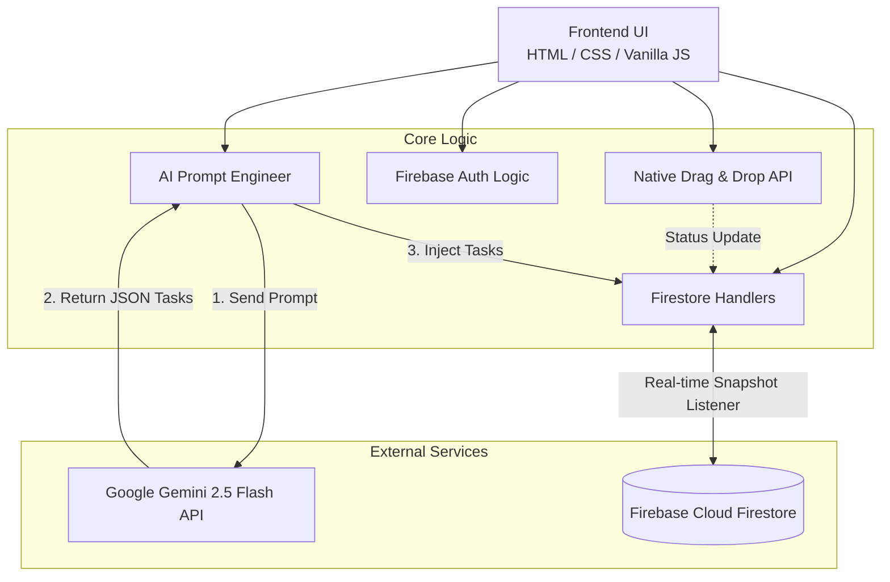

# ✨ AI-Powered Kanban Board


A premium, highly interactive **Real-time Kanban Board** featuring native Drag & Drop functionality, glassmorphism aesthetics, and integrated AI task generation. Built to demonstrate proficiency in modern web engineering without relying on heavy frameworks.

---

## 🚀 Key Features

*   **🪄 AI Task Decomposition:** Input a broad project idea, and the integrated **Google Gemini 2.5 Flash** model will instantly break it down into actionable tasks.
*   **🤖 AI Agile Coach:** Click the "Analytics" button to have the AI review your entire board and provide immediate, punchy feedback on your workload distribution.
*   **🔒 Private Authenticated Boards:** Features **Firebase Authentication (Google Sign-In)**, ensuring each user has a completely isolated, private workspace.
*   **📱 Cross-Device Drag & Drop:** Implements Native HTML5 Drag and Drop, enhanced with a custom Polyfill for seamless touch interactions on mobile devices.
*   **⚡ Real-Time Synchronization:** Powered by **Firebase Firestore**, any task moved, added, or deleted instantly updates across all open clients/tabs without requiring a page refresh.
*   **🖐️ Native Drag & Drop:** Implements the HTML5 Native Drag and Drop API for smooth, zero-dependency card movement across columns.
*   **💎 Premium UI/UX:** Features a modern Dark Mode interface with Glassmorphism (blur filters), CSS micro-animations, and dynamic visual feedback during drag operations.
*   **🔒 Client-Side Security:** API Keys are dynamically requested and securely stored in the browser's `localStorage`, ensuring credentials are never exposed in the source code.

---

## 🏗️ System Architecture



---

## 🛠️ Technical Highlights

### 1. The Power of Native APIs
Instead of relying on heavy libraries like `react-beautiful-dnd`, this project leverages the raw power of the **HTML5 Drag and Drop API**. 
```javascript
// Native event listeners for seamless interactions
card.addEventListener('dragstart', () => card.classList.add('dragging'));
list.addEventListener('dragover', e => {
    e.preventDefault(); // Crucial for enabling drop
    list.appendChild(document.querySelector('.dragging'));
});
```

### 2. Live State Management
State is managed completely in the cloud. By utilizing `onSnapshot()`, the application listens to the database. If a card is moved in Window A, Window B receives the snapshot payload and re-renders the DOM immediately.

### 3. AI Hallucination Handling
The Gemini API is prompted to return **strict JSON arrays**. The Javascript engine then sanitizes the response (stripping markdown backticks if the AI disobeys) and safely parses it before writing directly into the database stream.

---

## 🖥️ Local Setup & Installation

1. **Clone the repository:**
   ```bash
   git clone https://github.com/romeototo/ai-kanban-board.git
   cd ai-kanban-board
   ```
2. **Setup Firebase:**
   - Create a Firebase Project and enable **Firestore** (Test Mode).
   - Update the `firebaseConfig` block in `script.js` with your own credentials.
3. **Run the App:**
   - Use VS Code **Live Server** or Python's HTTP Server:
   ```bash
   python -m http.server 8000
   ```
4. **Setup AI:**
   - Obtain an API key from [Google AI Studio](https://aistudio.google.com/).
   - The app will securely prompt you for this key upon first use.

---

<div align="center">
  <b>Architected & Engineered by <a href="https://github.com/romeototo">RoMEoTOTO</a></b><br>
  <i>Showcasing the intersection of Web Engineering and Artificial Intelligence.</i>
</div>
